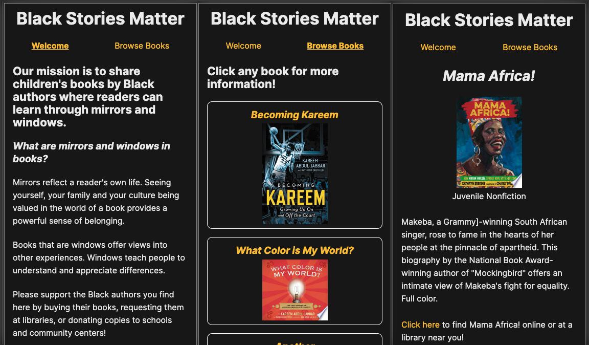

# Black Stories Matter 
The goal of Black Stories Matter is to showcase a database of children's books by Black authors for educators, families and youth. 
Black users can find “Mirrors”, stories they see themselves in. Other users visit for “Windows”, stories that give them a look into another experience.

[Deployed application](https://blackstoriesmatter.herokuapp.com/)

## Installation
- Fork and clone this repo into an empty directory on your local machine.
- Run `npm install` in your teminal to install the project's dependencies.
- Run `npm start` to run the application in development mode.
- Visit http://localhost:3000 to view in the browser.

## Technologies
- This project was bootstrapped with [Create React App](https://github.com/facebook/create-react-app).
- This project was styled mobile-first with [styled-components](https://styled-components.com/docs/basics) and [Bahunya](https://github.com/Kimeiga/bahunya), a classless CSS framework with responsive typography, navbar, and syntax highlighting.

## Future Iterations
We would like to continue adding books to the database and add more functionality to the front end user interface.
Please see the [CONTRIBUTING](CONTRIBUTING.md) file if you are interested in making an open source contribution to this project!

## Contributors
- Front End [Repo](https://github.com/Black-Stories-Matter/black-stories-matter-fe) 
  - [Lauren Lucero](https://github.com/laurenlucero)
- Back End [Repo](https://github.com/Black-Stories-Matter/black_stories_matter_api) 
  - [Krista Stadler](https://github.com/kristastadler)
